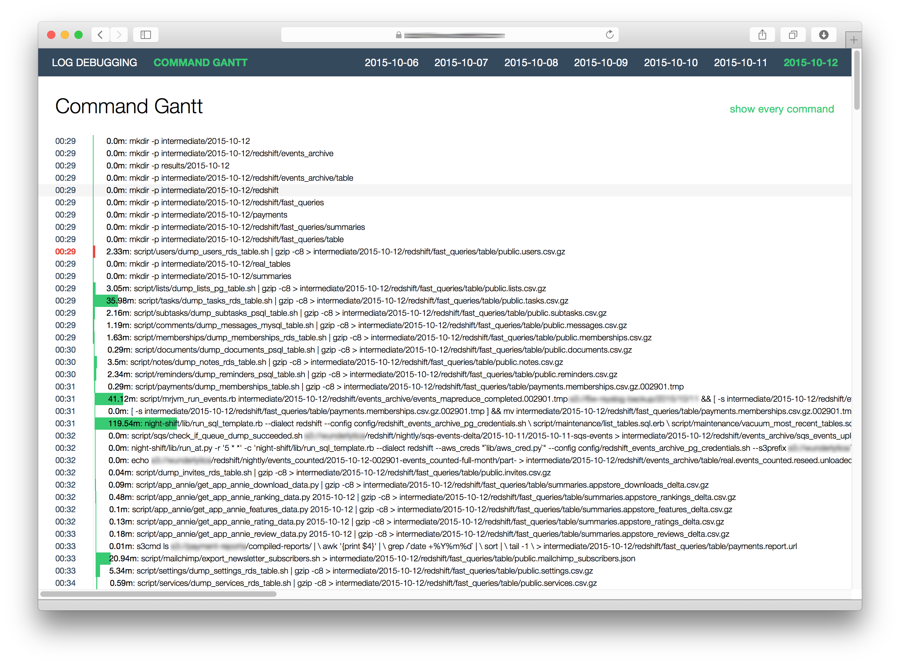

# A framework for nightly batch data processing using GNU Make

In 2013 [@torsten](https://github.com/torsten) wanted to set up a batch job manager for the Wunderlist data pipeline. Evaluating Amazon Data Flow, [Oozie](http://oozie.apache.org) and [Luigi](http://luigi.readthedocs.org/en/stable/) all seemed to be overkill. Inspired by [Mike Bostock](http://bost.ocks.org/mike/make/) he started out rolling one `Makefile` started by a `cronjob`. In two years this tool has been grown to accomodate the needs and in 2015 we open sourced the **skeleton** of the add-ons that make your life easier going old skool and seventies or KISS, you may say.

This repo is currently in production reaching out to dozens of sources and running hundreds of SQLs. If you are interested in our setup, check out [this presentation](http://www.slideshare.net/soobrosa/6w-bp-datashow).

## Features

- `Makefile` wrapper that gets triggered by `cron`. It tries to run it at most `MAX_ATTEMPTS` times.
- Runs all make targets in a [trackingshell](https://github.com/wunderlist/trackingshell), so timing information, output and errors could be logged. You can add extra steps too (e.g.: upload results into S3).
- Has a timer script for `cron` like target timing.
- Has a script to inject conditionals, variables and `Ruby` logic into `SQL`.
- Converts `SQL` results into `CSV` from **mysql**, **postgresql** and **redshift**.
- Tests to keep your makefile clean.
- Has a `Flask` application to monitor your logs.

## Principles

Our mantra is "_Keep it simple_" and "_Don't re-invent the wheel_". According to this we have a few solid principles:

- Use `cron` for scheduling.
- Use `make` for dependencies, partial results, and retries.
- Glue everything together with a hand full of bash script.
	1. Most process handling and output redirection should be handled by `bash` and `make`. Because they are good at it and it is more work to do right in `Ruby` or `Python`.
	2. All complex logic (and math) should be in `Ruby` or `Python`.
- Use `Python` or `Ruby` for the actual workers.
- Inject variables and logic into SQL with Ruby's `ERB`.

## What's in the box?

Running `night-shift/lib/run_workflow.sh` will

- start/continue your makefile execution
- log every target into `logs/<date>/trackingshell.log`, `logs/<date>/timing_env.log` and `logs/<date>/targetname.log`.
- log every attempt into `logs/<date>/attempt-*.log`.

Running `night-shift/lib/run_sql_template.rb` will inject variables into SQLs and execute them. You have to define `--dialect` and `--config` parameters.

```bash
$ night-shift/lib/run_sql_template.rb --dialect redshift --config config/dbname_redshift.sh --var1name value --var2name value \
    script/template1.erb.sql \
    script/template2.erb.sql
```

Running `night-shift/lib/run_at.py` will give you cron line target scheduling.

```bash
$ night-shift/lib/run_at -r '1,8 * *' -c 'command'
```

Running `night-shift/tests/run.sh` will

- test for makefile target for production
- collect unused or wrong makefile targets
- check unused files in the script folder
- check unused template variables.

Running `night-shift/web/app.py` will

- give you a debug interface for your log files. 


- visualize the command gantt



There's also a test for checking whether log size is below or above threshold.

## How you can use it?

1. Create a directory for your data-flow.
2. Add night-shift as submodule.

   ```
   $ git submodule add git@github.com:wunderlist/night-shift.git
   ```

3. Install dependencies.

   ```bash
   $ pip install -r requirements.txt
   $ pip install -r web/requirements.txt # for web interface
   ```

4. Create a folder for config files and scripts.

   ```
   $ mkdir config script
   ```
 
5. Set your configurations. You can find samples in the `night-shift/config` directory. 

   ```bash
   $ cp night-shift/config/dialect_postgres.sh.sample config/dbname_postgres.sh
   $ nano config/dbname_postgres.sh
   ```
    
   Change the parameters in the file.
    
   ```sh
   export PGHOST="localhost"
   export PGPORT=5432
   export PGDATABASE="dbname" 
   export PGUSER="username" 
   export PGPASSWORD="password"
   ```

6. Create a `makefile`.

   ```bash
   $ echo "include night-shift/lib/boilerplate.mk" > makefile
   ```

7. Write your own make targets. You can extend the build in targets like:
   - **scaffold**: Create necessary directory structure.
   - **nuke**: Removes every file. Gives you a clean slate during development.
   - **cleanup**: Terminate pending resources.
   - **backup**: Backup files after the nightly.

   Extending is easy (use `::` after the target's name):
   
   ```makefile
   scaffold:: intermediate/$(TODAY)
   intermediate/$(TODAY):
     mkdir -p $@
   ```

8. Set up your night-shift configuration file.

   ```bash
   $ cp night-shift/config/night_shift.sh.sample config/night_shift.sh
   $ nano config/night_shift.sh
   ```
   
   Add your top level targets after `scaffold` that you want to execute.
   
   ```sh
   export NIGHT_SHIFT_TARGETS="scaffold"
   ```
   
   Set data-flow directory's path.

   ```sh
   export NIGHT_SHIFT_PROJECT_DIR=""
   ```

9. **(On production)** Extend your `cron` settings. with

   ```bash
   source config/night_shift.sh && night-shift/lib/run_workflow.sh 
   ```

## Examples

You can check out the `examples` folder for working examples.


## How you can extend it?

####  [Trackingshell](https://github.com/wunderlist/trackingshell)
You can track the target execution of a makefile with this tool easily. If you need more logs or you want to add some automatic magic before/after every target execution.

Create a `lib/tracking_shell.py` file.

```python
import trackingshell as ts

# import the trackingshell of night-shift
night_shift_ts = imp.load_module('tracking_shell', *imp.find_module('tracking_shell', ['night-shift/lib/']))

# define your own plugins
# more information: https://github.com/wunderlist/trackingshell
...

if __name__ == '__main__':
    shell = ts.Shell(sys.argv[1:])
    shell.parser.add_argument('-d', '--date', help="current date")
    shell.cls = night_shift_ts.MakeTarget
    # register your new plugins
    shell.plugins.register(your_plugin1)
    shell.plugins.register(your_plugin2)
    ...
    # register night-shift's plugins.
    shell.plugins.register(night_shift_ts.timing_env_plugin)
    shell.plugins.register(night_shift_ts.target_plugin)
    shell.delegate()
```

After that you have to add a line to your `makefile`.

```makefile
SHELL=./lib/tracking_shell.py --target $@ --date $(TODAY)
```

## License

Copyright © 2013-2015 6Wunderkinder GmbH.

Distributed under the MIT License.


